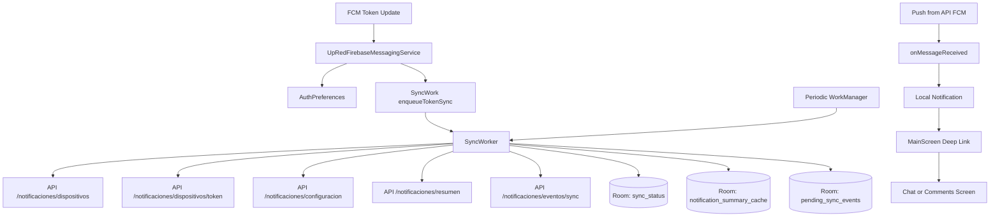

# Corte 3 - Flujo FCM + WorkManager + Room

Este documento describe el flujo técnico implementado para Persona 1.

## 1. Flujo de token FCM

1. Firebase entrega token en `UpRedFirebaseMessagingService.onNewToken`.
2. App guarda token en `AuthPreferences`.
3. App encola `SyncWork.enqueueTokenSync`.
4. `SyncWorker` toma token + `device_uuid` y llama:
   - `POST /api/notificaciones/dispositivos`
   - `PUT /api/notificaciones/dispositivos/token`

## 2. Flujo de push entrante

1. API envía notificación push vía FCM (ejemplo `POST /api/notificaciones/push/test`).
2. Android recibe en `UpRedFirebaseMessagingService.onMessageReceived`.
3. Se crea notificación local con `PendingIntent` y extras de deep link.
4. `MainScreen` consume extras y navega a:
   - chat (`Screen.Chat`) o
   - publicación/comentarios (`Screen.Comments`).

## 3. Flujo WorkManager periódico

1. `DemoHiltApp` agenda `SyncWork.schedulePeriodicSync`.
2. Cada ejecución de `SyncWorker` realiza:
   - sincronización de token FCM,
   - lectura/sync de configuración remota,
   - actualización de resumen de notificaciones (`/api/notificaciones/resumen`),
   - flush de eventos diferidos (`/api/notificaciones/eventos/sync`).
3. Se actualiza `sync_status` en Room con:
   - `lastSyncAt`,
   - `pendingCount`,
   - `lastError`.

## 4. Estrategia Room usada

- Publicaciones: online-first + fallback offline (existente).
- Sync técnico:
  - `sync_status` para estado operativo.
  - `pending_sync_events` para cola de eventos no críticos.
  - `notification_summary_cache` para cache ligera de no leídas.
- TTL básico:
  - `lastFetchedAt` en resumen de notificaciones,
  - refresco periódico con WorkManager.

## 5. Pantalla nueva de soporte

Se agrega `Screen.SyncStatus` para mostrar:

- última sincronización,
- cantidad de pendientes,
- no leídas cacheadas,
- último error,
- acción manual "Reintentar ahora".

## 6. Diagrama

