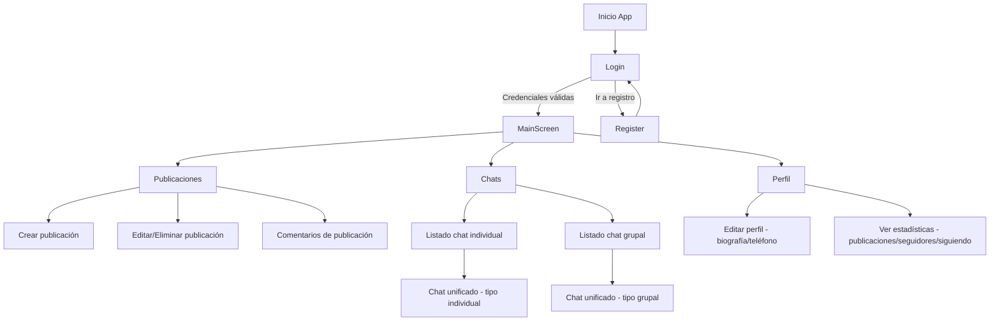
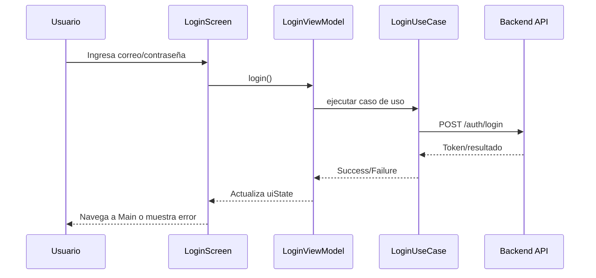
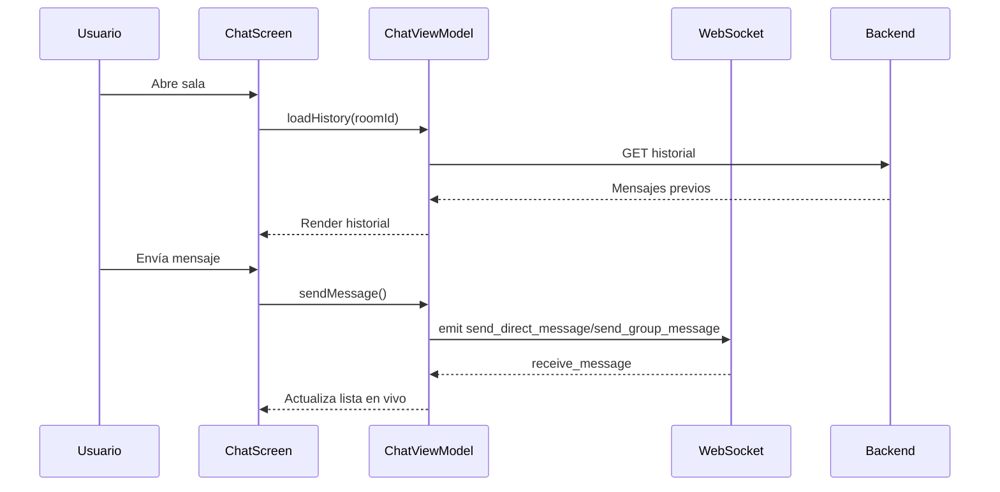

# Desarrollo del producto

## Construcción del producto

### 1) Diagramas del flujo implementado en la aplicación móvil

A continuación se presentan diagramas de referencia del flujo principal de RED-UP.

#### 1.1 Flujo general de navegación



**Descripción:**
- El acceso inicia en autenticación y redirige al contenedor principal con navegación inferior.
- La barra inferior presenta tres secciones: **Publicaciones**, **Chats** y **Perfil**.
- Desde el feed de publicaciones se puede navegar a los comentarios de cada publicación.
- El perfil muestra datos reales del usuario autenticado obtenidos desde la API, con opción de edición.
- El chat se unifica en una sola pantalla con parámetro de tipo de sala.

#### 1.2 Flujo de autenticación



**Descripción:**
- Se aplica patrón de estado en `uiState` para controlar carga, éxito y error.
- La navegación posterior a login limpia el backstack de autenticación.

#### 1.3 Flujo de mensajería en tiempo real



**Descripción:**
- El historial se carga por API REST y la conversación en curso se mantiene con WebSocket.
- Este enfoque mezcla persistencia y respuesta en tiempo real.

---

### 2) Problemas relevantes y decisiones arquitectónicas

#### Problema 1: Acoplamiento entre pantallas y navegación
- **Situación:** múltiples flujos (auth, publicaciones, comentarios, chats, perfil) elevan complejidad de rutas.
- **Decisión:** centralizar rutas en `Screen` y orquestación en `MainScreen` con `NavHost`.
- **Resultado:** mayor mantenibilidad; rutas tipadas con `createRoute(param)` para destinos parametrizados como `Comments.createRoute(publicacionId)` o `EditPublicacion.createRoute(id)`.

#### Problema 2: Estados de UI inconsistentes en operaciones asíncronas
- **Situación:** carga de datos, errores de red y éxito de operación compiten entre sí.
- **Decisión:** uso de `ViewModel` + `StateFlow` por feature, con campos `isLoading`, `error` y `success`.
- **Resultado:** representación predecible de estados en Compose y limpieza explícita de mensajes con `clearMessages()`.

#### Problema 3: Integrar datos remotos y persistencia local
- **Situación:** necesidad de datos en red y soporte local para ciertas entidades.
- **Decisión:** Retrofit para API y Room para almacenamiento local, inyectados por Hilt.
- **Resultado:** separación clara de fuentes de datos y preparación para mejoras offline.

#### Problema 4: Comunicación instantánea en chats
- **Situación:** REST por sí solo no cubre latencia de mensajes en conversación activa.
- **Decisión:** arquitectura híbrida REST + WebSocket.
- **Resultado:** historial confiable vía API + entrega en tiempo real de mensajes y presencia.

#### Problema 5: NPE en parsing de publicaciones con multimedia nula
- **Situación:** la API podía devolver `multimedia: null` al obtener el feed, provocando `NullPointerException` en el mapper.
- **Decisión:** declarar `multimedia` como nullable en el DTO y usar `orEmpty()` en el mapper.
- **Resultado:** el feed carga sin excepciones independientemente de si la publicación tiene o no archivos adjuntos.

#### Problema 6: Error 413 al subir imágenes
- **Situación:** imágenes de cámara sin comprimir superaban el límite del servidor.
- **Decisión:** comprimir, redimensionar (máx. 1024 px) y corregir rotación EXIF antes de enviar el multipart.
- **Resultado:** publicaciones con imagen se envían correctamente dentro del límite de tamaño.

#### Problema 7: Error 500 al subir imagen cuando Cloudinary no está configurado
- **Situación:** si las variables de entorno de Cloudinary no estaban presentes, el backend lanzaba excepción no controlada al intentar subir.
- **Decisión:** implementar fallback que almacena los bytes de la imagen directamente en la base de datos (`datos_archivo`) y sirve la imagen por el endpoint `/api/publicaciones/{id}/imagen`.
- **Resultado:** las publicaciones con imagen se crean correctamente en cualquier entorno (con o sin Cloudinary).

#### Problema 8: Perfil y comentarios con datos ficticios
- **Situación:** `ProfileViewModel` y `CommentsViewModel` usaban datos hardcodeados (mocks) sin llamadas reales a la API.
- **Decisión:** reescribir ambos ViewModels para consumir endpoints reales (`/api/usuarios/perfil/actual`, `/api/usuarios/{id}/stats`, `/api/publicaciones/{id}/comentarios`, etc.).
- **Resultado:** el perfil muestra nombre, correo, carrera, biografía, estadísticas y permite actualizar datos; los comentarios cargan, se publican y se eliminan en tiempo real.

#### Problema 9: Pantallas de perfil y comentarios con fondo blanco en tema oscuro
- **Situación:** los scaffolds usaban `background(Color.White)` hardcodeado ignorando el tema del sistema.
- **Decisión:** reemplazar todos los fondos y colores de texto estáticos por `MaterialTheme.colorScheme.*`.
- **Resultado:** perfil, edición de perfil y comentarios respetan el tema oscuro de la app.

#### Problema 10: Escalabilidad del proyecto
- **Situación:** crecimiento funcional (auth, publicaciones, comentarios, chats, perfil).
- **Decisión:** organización por features con capas de presentación/dominio/datos donde aplica.
- **Resultado:** menor impacto entre módulos y mejor capacidad de evolución por incrementos.

---

### 3) Porciones de código relevantes documentadas

#### 3.1 Rutas centralizadas

**Qué resuelve:** evita strings dispersos y errores de navegación.

```kotlin
sealed class Screen(val route: String) {
    object Login : Screen("login")
    object Register : Screen("register")
    object Main : Screen("main")
    object Profile : Screen("profile")
    object EditProfile : Screen("edit_profile")
    object Comments : Screen("comments/{publicacionId}") {
        fun createRoute(publicacionId: Long) = "comments/$publicacionId"
    }
    object EditPublicacion : Screen("edit_publicacion/{publicacionId}") {
        fun createRoute(publicacionId: Int) = "edit_publicacion/$publicacionId"
    }
    object Chat : Screen("chat/{roomId}/{roomName}/{roomType}") {
        fun createRoute(roomId: String, roomName: String, roomType: String) =
            "chat/$roomId/$roomName/$roomType"
    }
}
```

#### 3.2 Inyección de dependencias de red

**Qué resuelve:** configuración única del cliente HTTP y base URL.

```kotlin
@Module
@InstallIn(SingletonComponent::class)
object NetworkModule {
    @Provides
    @Singleton
    fun provideOkHttpClient(authInterceptor: AuthInterceptor): OkHttpClient {
        return OkHttpClient.Builder()
            .addInterceptor(authInterceptor)
            .build()
    }

    @Provides
    @Singleton
    @UpRedRetrofit
    fun provideRetrofit(okHttpClient: OkHttpClient): Retrofit {
        return Retrofit.Builder()
            .baseUrl(BuildConfig.BASE_URL_UPRED)
            .client(okHttpClient)
            .addConverterFactory(GsonConverterFactory.create())
            .build()
    }
}
```

#### 3.3 Manejo de estado en login

**Qué resuelve:** flujo claro de carga/error/éxito para UI reactiva.

```kotlin
data class LoginUiState(
    val email: String = "",
    val password: String = "",
    val hasBiometricCredentials: Boolean = false,
    val isLoading: Boolean = false,
    val error: String? = null,
    val isSuccess: Boolean = false
)
```

#### 3.4 DTOs de comentarios y perfil

**Qué resuelve:** tipado fuerte de respuestas de la API para comentarios, perfil de usuario y estadísticas.

```kotlin
data class CommentDto(
    @SerializedName("id") val id: Long,
    @SerializedName("contenido") val contenido: String,
    @SerializedName("usuario_id") val usuarioId: Long,
    @SerializedName("creado_en") val creadoEn: String,
    @SerializedName("usuario") val usuario: CommentUserDto? = null
)

data class ProfileDto(
    @SerializedName("id") val id: Long,
    @SerializedName("nombre") val nombre: String,
    @SerializedName("apellido_paterno") val apellidoPaterno: String,
    @SerializedName("foto_perfil_url") val fotoPerfilUrl: String? = null,
    @SerializedName("biografia") val biografia: String? = null,
    @SerializedName("carrera") val carrera: CarreraDto? = null
)

data class UserStatsDto(
    @SerializedName("total_seguidores") val totalSeguidores: Int = 0,
    @SerializedName("total_siguiendo") val totalSiguiendo: Int = 0,
    @SerializedName("total_publicaciones") val totalPublicaciones: Int = 0
)
```

#### 3.5 Fallback de imagen en backend

**Qué resuelve:** evita error 500 cuando Cloudinary no está configurado.

```python
if cloudinary_service.is_configured():
    cloudinary_url = cloudinary_service.upload_image(file_data, public_id)
    multimedia = MultimediaPublicacion(
        publicacion_id=nueva_publicacion.id,
        tipo=TipoMensaje.imagen,
        url_archivo=cloudinary_url,
        datos_archivo=None,
        orden=index
    )
else:
    multimedia = MultimediaPublicacion(
        publicacion_id=nueva_publicacion.id,
        tipo=TipoMensaje.imagen,
        url_archivo=None,
        datos_archivo=file_data,  # Almacenamiento binario local
        orden=index
    )
```

---

### 4) Repositorio del proyecto

- **Repositorio Android:** `RED-UP-HILT` — módulo `app` con arquitectura por features.
- **Repositorio Backend:** `API_UPRed` — FastAPI + SQLAlchemy + MySQL, desplegado en EC2.
- **Estructura destacada Android:** navegación centralizada en `Screen` + `MainScreen`, features de `auth` / `publicaciones` / `comments` / `chat` / `profile`, capa `core` de DI/red/base de datos.
- **Estructura destacada Backend:** routers por dominio (`publicaciones`, `comentarios`, `usuarios`, `auth`, `mensajes`), modelos SQLAlchemy, schemas Pydantic, servicios (Cloudinary, WebSocket).
- **Configuración relevante:** flavors `dev`/`prod` con URLs en `BuildConfig`, dependencias Compose/Hilt/Room/Retrofit/Socket/Coil, autenticación JWT en todos los endpoints protegidos.

---

## Resultados

Este apartado presenta las pantallas funcionales implementadas y validadas en el producto actual.

### 1) Autenticación
- **Pantalla:** Login con correo/contraseña y login biométrico.
- **Estado:** funcional. La huella digital recupera credenciales cifradas y ejecuta el login sin contraseña.
- **Flujo de error:** validaciones locales y mensajes de error del backend representados en el estado de la UI.

### 2) Registro
- **Pantalla:** Crear cuenta con datos personales y correo institucional.
- **Estado:** funcional. Verifica correo contra catálogo institucional del backend antes de crear la cuenta.

### 3) Feed de publicaciones
- **Pantalla:** lista de publicaciones con imagen (cuando aplica), nombre del autor, fecha y contadores de reacciones y comentarios.
- **Estado:** funcional. Imágenes cargadas desde Cloudinary o directamente desde la base de datos según configuración del entorno.
- **Acciones disponibles:** crear publicación (con imagen), editar y eliminar publicaciones propias, navegar a comentarios.

### 4) Comentarios
- **Pantalla:** pantalla de comentarios de una publicación, accesible desde el botón de comentarios en el feed.
- **Estado:** funcional. Carga comentarios reales desde la API, permite agregar nuevos y eliminar los propios. Compatible con tema oscuro.

### 5) Perfil de usuario
- **Pantalla:** perfil propio con avatar generado por inicial, nombre, correo, carrera, biografía y estadísticas (publicaciones, seguidores, siguiendo).
- **Estado:** funcional. Datos cargados desde la API en tiempo real. Compatible con tema oscuro.
- **Edición:** pantalla de edición permite actualizar biografía y teléfono.

### 6) Chats
- **Pantalla:** hub de chats con acceso a chat individual y chat grupal.
- **Estado:** funcional. Historial vía API REST y mensajes en tiempo real vía WebSocket. Indicadores de estado en línea y escritura.

### 7) Navegación principal
- **Pantalla:** contenedor principal con barra inferior de tres ítems: **Publicaciones**, **Chats** y **Perfil**.
- **Estado:** funcional. Barra inferior dinámica con indicador de ítem activo y tema oscuro aplicado en todas las secciones.

---

## Conclusiones

### Sobre metodologías y herramientas

- El enfoque incremental por MVPs permitió construir valor funcional desde etapas tempranas, entregando primero autenticación, luego feed y finalmente interacción social (comentarios, perfil, chat).
- La arquitectura modular por features limitó el impacto de cada cambio a su dominio correspondiente, evitando regresiones en módulos adyacentes.
- Jetpack Compose aceleró la iteración de UI y permitió aplicar el tema del sistema (oscuro/claro) de forma global con mínimos cambios.

### Sobre técnicas utilizadas

- La combinación `ViewModel + StateFlow` facilitó una UI reactiva y trazable, con estados explícitos de `isLoading`, `error` y `success` en cada feature.
- Hilt simplificó la inyección de dependencias entre capas, incluyendo la inyección de `UpRedApi` directamente en ViewModels sin boilerplate de fábricas.
- Retrofit + Room + WebSocket cubrió necesidades mixtas: consumo REST para CRUD y WebSocket para eventos en tiempo real.
- El fallback de almacenamiento binario en base de datos para imágenes garantiza operación en cualquier entorno, con o sin Cloudinary configurado.
- El uso de `PublicationMapper.resolveAbsoluteUrl` normaliza tanto URLs absolutas de Cloudinary como rutas relativas del endpoint de imagen local, con un único punto de resolución.

### Conclusión general

RED-UP demuestra viabilidad técnica y funcional como red universitaria móvil. Al cierre de este documento, las funcionalidades de autenticación (incluida biometría), publicaciones con multimedia, comentarios, perfil de usuario y comunicación en tiempo real están implementadas y probadas. Como evolución natural del producto, se recomienda priorizar notificaciones push, moderación de contenido, seguimiento de usuarios desde el feed y analítica de uso para fortalecer la escalabilidad y adopción de la plataforma.
