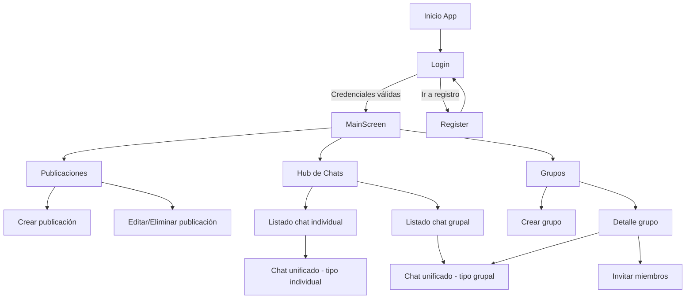
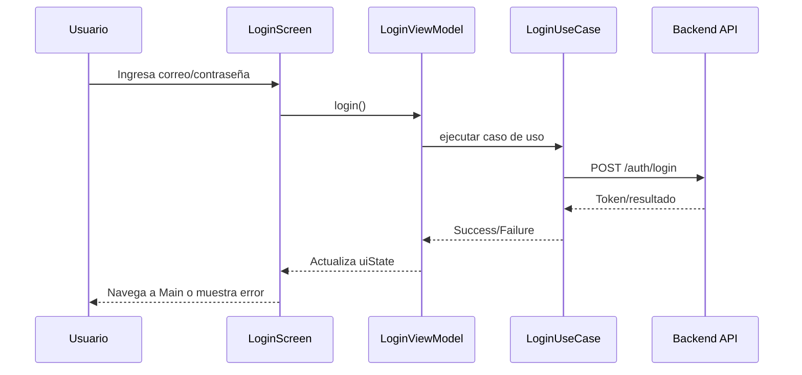
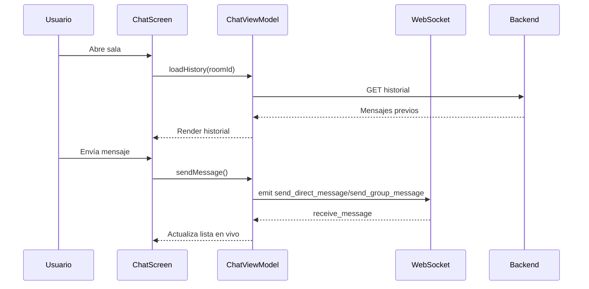

# Desarrollo del producto

## Construcción del producto

### 1) Diagramas del flujo implementado en la aplicación móvil

A continuación se presentan diagramas de referencia del flujo principal de RED-UP.

#### 1.1 Flujo general de navegación



**Descripción:**
- El acceso inicia en autenticación y redirige al contenedor principal con navegación inferior.
- Desde el contenedor se accede a publicaciones, chats y grupos.
- El chat se unifica en una sola pantalla con parámetro de tipo de sala.

#### 1.2 Flujo de autenticación



**Descripción:**
- Se aplica patrón de estado en `uiState` para controlar carga, éxito y error.
- La navegación posterior a login limpia el backstack de autenticación.

#### 1.3 Flujo de mensajería en tiempo real



**Descripción:**
- El historial se carga por API REST y la conversación en curso se mantiene con WebSocket.
- Este enfoque mezcla persistencia y respuesta en tiempo real.

---

### 2) Problemas relevantes y decisiones arquitectónicas

#### Problema 1: Acoplamiento entre pantallas y navegación
- **Situación:** múltiples flujos (auth, publicaciones, grupos, chat) elevan complejidad de rutas.
- **Decisión:** centralizar rutas en `Screen` y orquestación en `NavigationGraph`.
- **Resultado:** mayor mantenibilidad, rutas tipadas por función `createRoute(...)` en destinos con parámetros.

#### Problema 2: Estados de UI inconsistentes en operaciones asíncronas
- **Situación:** carga de datos, errores de red y éxito de operación compiten entre sí.
- **Decisión:** uso de `ViewModel` + `StateFlow`/`uiState` por feature.
- **Resultado:** representación predecible de estados (`isLoading`, `error`, `data`) en Compose.

#### Problema 3: Integrar datos remotos y persistencia local
- **Situación:** necesidad de datos en red y soporte local para ciertas entidades.
- **Decisión:** Retrofit para API y Room para almacenamiento local, inyectados por Hilt.
- **Resultado:** separación clara de fuentes de datos y preparación para mejoras offline.

#### Problema 4: Comunicación instantánea en chats
- **Situación:** REST por sí solo no cubre latencia de mensajes en conversación activa.
- **Decisión:** arquitectura híbrida REST + WebSocket (Socket client).
- **Resultado:** historial confiable + entrega en tiempo real (mensajes y presencia).

#### Problema 5: Escalabilidad del proyecto
- **Situación:** crecimiento funcional (auth, publicaciones, chats, grupos, perfil).
- **Decisión:** organización por features con capas de presentación/dominio/datos donde aplica.
- **Resultado:** menor impacto entre módulos y mejor capacidad de evolución por incrementos.

---

### 3) Porciones de código relevantes documentadas

#### 3.1 Rutas centralizadas

**Qué resuelve:** evita strings dispersos y errores de navegación.

```kotlin
sealed class Screen(val route: String) {
    object Login : Screen("login")
    object Register : Screen("register")
    object Main : Screen("main")
    object Chat : Screen("chat/{roomId}/{roomName}/{roomType}") {
        fun createRoute(roomId: String, roomName: String, roomType: String) =
            "chat/$roomId/$roomName/$roomType"
    }
}
```

#### 3.2 Inyección de dependencias de red

**Qué resuelve:** configuración única del cliente HTTP y base URL.

```kotlin
@Module
@InstallIn(SingletonComponent::class)
object NetworkModule {
    @Provides
    @Singleton
    fun provideOkHttpClient(authInterceptor: AuthInterceptor): OkHttpClient {
        return OkHttpClient.Builder()
            .addInterceptor(authInterceptor)
            .build()
    }

    @Provides
    @Singleton
    @UpRedRetrofit
    fun provideRetrofit(okHttpClient: OkHttpClient): Retrofit {
        return Retrofit.Builder()
            .baseUrl(BuildConfig.BASE_URL_UPRED)
            .client(okHttpClient)
            .addConverterFactory(GsonConverterFactory.create())
            .build()
    }
}
```

#### 3.3 Manejo de estado en login

**Qué resuelve:** flujo claro de carga/error/éxito para UI reactiva.

```kotlin
data class LoginUiState(
    val email: String = "",
    val password: String = "",
    val hasBiometricCredentials: Boolean = false,
    val isLoading: Boolean = false,
    val error: String? = null,
    val isSuccess: Boolean = false
)
```

---

### 4) Repositorio del proyecto

- Repositorio Android: módulo `app` dentro del proyecto RED-UP.
- Estructura destacada: navegación, features de auth/publicaciones/chats/grupos, capa `core` de DI/red/base de datos.
- Configuración relevante: flavors `dev`/`prod`, URLs en `BuildConfig`, dependencias Compose/Hilt/Room/Retrofit/Socket.

---

## Resultados

Este apartado presenta el producto como “mapa funcional”, con sugerencia de evidencia visual por pantalla.

### 1) Autenticación
- **Pantalla:** Login.
- **Descripción de imagen sugerida:** formulario de acceso, validaciones y transición a pantalla principal.

### 2) Registro
- **Pantalla:** Crear cuenta.
- **Descripción de imagen sugerida:** captura de campos de registro y mensaje de éxito.

### 3) Home / Publicaciones
- **Pantalla:** Feed de publicaciones.
- **Descripción de imagen sugerida:** lista de publicaciones, botón flotante para crear publicación y acciones de edición/eliminación.

### 4) Chat individual
- **Pantalla:** Listado de conversaciones + búsqueda de usuario.
- **Descripción de imagen sugerida:** diálogo de búsqueda por nombre/correo y apertura de conversación.

### 5) Chat grupal
- **Pantalla:** Listado de grupos de chat y sala grupal.
- **Descripción de imagen sugerida:** grupos disponibles y conversación activa con mensajes en tiempo real.

### 6) Gestión de grupos
- **Pantalla:** Crear grupo / detalle / invitar miembros.
- **Descripción de imagen sugerida:** flujo de creación, detalle de grupo y formulario de invitación.

### 7) Navegación principal
- **Pantalla:** Contenedor principal con navegación inferior.
- **Descripción de imagen sugerida:** tabs de Publicaciones, Chats y Grupos, mostrando el cambio de vistas.

---

## Conclusiones

### Sobre metodologías y herramientas

- El enfoque incremental por MVPs permitió construir valor funcional desde etapas tempranas.
- El uso de arquitectura modular por features redujo el riesgo de cambios colaterales.
- Jetpack Compose aceleró la iteración de UI y la consistencia visual del producto.

### Sobre técnicas utilizadas

- La combinación `ViewModel + StateFlow` facilitó una UI reactiva y trazable.
- Hilt simplificó la inyección de dependencias entre capas y módulos.
- Retrofit + Room + WebSocket resolvió necesidades mixtas de persistencia, consumo API y tiempo real.

### Conclusión general

RED-UP demuestra viabilidad técnica y funcional como red universitaria móvil, cubriendo autenticación, publicaciones y comunicación sincrónica/asíncrona. Como evolución natural, conviene priorizar notificaciones push, multimedia y capacidades avanzadas de moderación/analítica para fortalecer escalabilidad y adopción.
