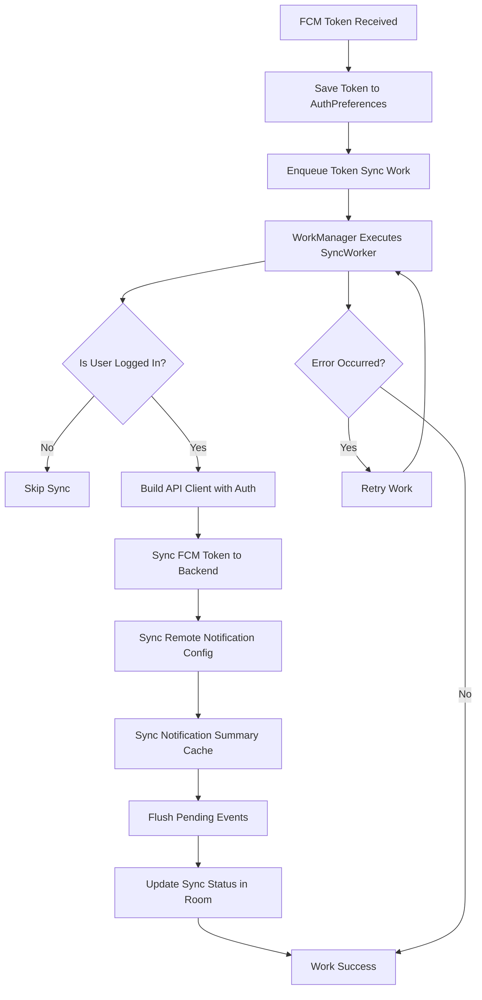
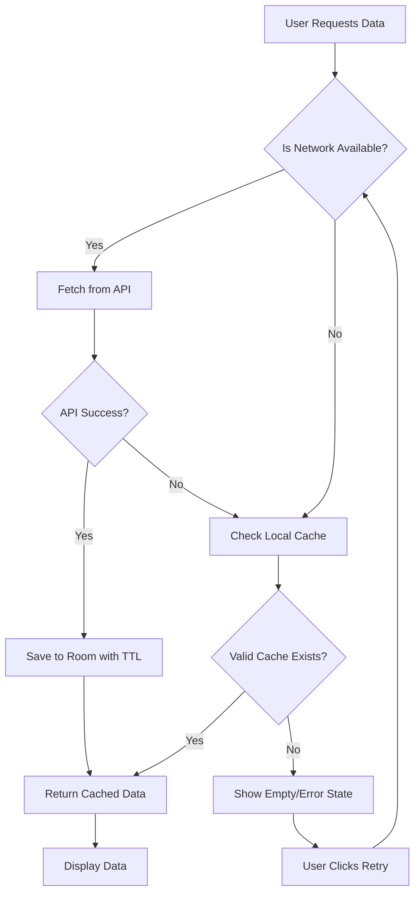

# Diagrama de Flujo: FCM + WorkManager + Room

## Arquitectura de Sincronización

## Estrategia Room: Online-First + Fallback + TTL + Refresh Explícito

## Estados de Sincronización

- **Última Sync**: Timestamp de última sincronización exitosa
- **Pendientes**: Número de eventos pendientes por enviar
- **Errores**: Último error de sincronización
- **Botón Reintentar**: Fuerza sync inmediato

## Checklist de Pruebas Offline/Online

### Online Tests
- [ ] FCM token se registra correctamente al backend
- [ ] Sync periódico funciona cada 15 minutos
- [ ] Configuración remota se actualiza
- [ ] Eventos pendientes se envían cuando hay red
- [ ] Cache se refresca automáticamente

### Offline Tests
- [ ] App funciona sin red usando cache
- [ ] Eventos se almacenan localmente
- [ ] Sync se reintenta cuando regresa internet
- [ ] Pantalla de sync muestra estado correcto
- [ ] Notificaciones push llegan sin conexión a internet

### Edge Cases
- [ ] Cambio de red durante sync
- [ ] Token FCM expira y se renueva
- [ ] Backend no responde temporalmente
- [ ] Usuario cierra app durante sync
- [ ] Múltiples sync simultáneos